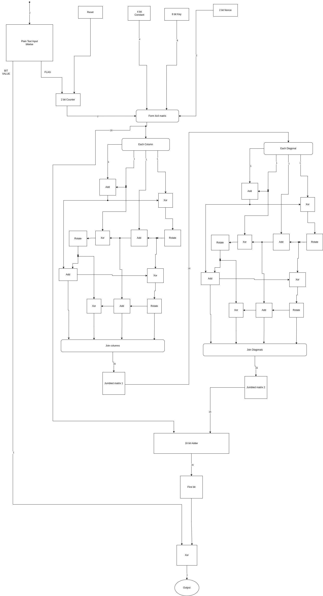

# Small Scale Implementation of ChaCha20 Encrypter

<!-- First Section -->

## Team Details

<details>
  <summary>Detail</summary>

> Semester: 3rd Sem B. Tech. CSE

> Section: S1

> Team ID: 19

> Member-1: Akhil Sakthieswaran, 231CS108, akhilsakthieswaran.231cs108@nitk.edu.in

> Member-2: Raunil Singh, 231CS148, raunilsingh.231cs148@nitk.edu.in

> Member-3: Sanjay S Bhat, 231CS153, sanjay.231cs153@nitk.edu.in

</details>

<!-- Second Section -->

## Abstract

<details>
  <summary>Detail</summary>
  
  > 
Implementing ChaCha20 on a small-scale hardware system offers an efficient and secure solution for resource-constrained devices like IoT and embedded systems. Its lightweight design ensures low power consumption and high performance without specialized hardware, whileproviding robust encryption, making it ideal for real-time data protection in energy-sensitive applications.<p>

The problem statement we are dealing with in our project is developing a hardware circuit implementation of the ChaCha20 encryption algorithm to enhance throughput, reduce latency, and minimize power consumption. Our design is planned to enable efficient processing for secure communications in embedded systems, addressing limitations found in software implementations while ensuring adaptability for various applications and maintaining high security standards.<p>

The main features of our project include removing the very drawbacks in the implementation of the chacha20 algorithm without using circuits. High latency in software can hinder real-time applications,which can be dealt with using circuits,as hardware circuits can reduce processing time through dedicated data paths and pipelining. Software often consumes more power due to CPU overhead.On the other hand,circuits can be designed for low power operation, ideal for battery-operated devices.Another major pro of using hardware circuits to implement the chacha20 algorithm is that hardware circuits can mitigate certain side-channel attacks through physical design features, enhancing overall security.Finally, software may require significant RAM and CPU resources. Circuits can use smaller, dedicated memory and logic components for efficiency,leading to significant optimization of the implementation

</details>

## Functional Block Diagram

<details>
  <summary>Detail</summary>

> 

</details>

<!-- Third Section -->

## Working

<details>
  <summary>Detail</summary>

> Explain how your model works with the help of a functional table (compulsory) followed by the flowchart.

</details>

<!-- Fourth Section -->

## Logisim Circuit Diagram

<details>
  <summary>Detail</summary>

> Update a neat logisim circuit diagram

</details>

<!-- Fifth Section -->

## Verilog Code

<details>
  <summary>Detail</summary>

> Encrpytion Module:

```verilog
//quarter round generator module
module qrg (
    input A, B, C, D,         // 4 inputs
    output reg a, b, c, d     // 4 outputs
);

    always @(*) begin
        case ({A, B, C, D})
            4'b0000: {a, b, c, d} = 4'b0000;
            4'b0001: {a, b, c, d} = 4'b1010;
            4'b0010: {a, b, c, d} = 4'b1101;
            4'b0011: {a, b, c, d} = 4'b0111;
            4'b0100: {a, b, c, d} = 4'b1110;
            4'b0101: {a, b, c, d} = 4'b0100;
            4'b0110: {a, b, c, d} = 4'b0011;
            4'b0111: {a, b, c, d} = 4'b1001;
            4'b1000: {a, b, c, d} = 4'b0101;
            4'b1001: {a, b, c, d} = 4'b1111;
            4'b1010: {a, b, c, d} = 4'b1000;
            4'b1011: {a, b, c, d} = 4'b0010;
            4'b1100: {a, b, c, d} = 4'b1011;
            4'b1101: {a, b, c, d} = 4'b0001;
            4'b1110: {a, b, c, d} = 4'b0110;
            4'b1111: {a, b, c, d} = 4'b1100;
        endcase
    end
endmodule
//2-bit counter module
module two_bit_counter (
    input wire clk,         // Clock input
    input wire reset,       // Asynchronous reset input
    input wire [1:0] init_value, // Initial value input
    input wire lock,        // Lock input to set initial value
    output reg [1:0] count  // 2-bit counter output
);

    always @(posedge clk or posedge reset or posedge lock) begin
        if (reset) begin
            count <= 2'b00;  // Reset counter to 0
        end else if (lock) begin
            count <= init_value;  // Set counter to initial value
        end else begin
            count <= count + 1;  // Increment counter
        end
    end

endmodule
//key stream generator module
module ksg (
    input [3:0] constant,
    input [7:0] key,
    input [1:0] counter,
    input [1:0] nonce,
    output [3:0] final_out1,
    output [3:0] final_out2,
    output [3:0] final_out3,
    output [3:0] final_out4
);
    wire [3:0] qrg_out1, qrg_out2, qrg_out3, qrg_out4;

    // First round of qrg instances with reversed input bits
    qrg qrg1 (
        .A(constant[3]), // Reversed
        .B(key[7]),      // Reversed
        .C(key[6]),      // Reversed
        .D(counter[1]),  // Reversed
        .a(qrg_out1[0]),
        .b(qrg_out1[1]),
        .c(qrg_out1[2]),
        .d(qrg_out1[3])
    );

    qrg qrg2 (
        .A(constant[2]), // Reversed
        .B(key[5]),      // Reversed
        .C(key[4]),      // Reversed
        .D(counter[0]),  // Reversed
        .a(qrg_out2[0]),
        .b(qrg_out2[1]),
        .c(qrg_out2[2]),
        .d(qrg_out2[3])
    );

    qrg qrg3 (
        .A(constant[1]), // Reversed
        .B(key[3]),      // Reversed
        .C(key[2]),      // Reversed
        .D(nonce[1]),    // Reversed
        .a(qrg_out3[0]),
        .b(qrg_out3[1]),
        .c(qrg_out3[2]),
        .d(qrg_out3[3])
    );

    qrg qrg4 (
        .A(constant[0]), // Reversed
        .B(key[1]),      // Reversed
        .C(key[0]),      // Reversed
        .D(nonce[0]),    // Reversed
        .a(qrg_out4[0]),
        .b(qrg_out4[1]),
        .c(qrg_out4[2]),
        .d(qrg_out4[3])
    );

    // Second round of qrg instances with cyclic input bits
    qrg qrg5 (
        .A(qrg_out1[0]),
        .B(qrg_out2[1]),
        .C(qrg_out3[2]),
        .D(qrg_out4[3]),
        .a(final_out1[3]),
        .b(final_out1[2]),
        .c(final_out1[1]),
        .d(final_out1[0])
    );

    qrg qrg6 (
        .A(qrg_out1[1]),
        .B(qrg_out2[2]),
        .C(qrg_out3[3]),
        .D(qrg_out4[0]),
        .a(final_out2[3]),
        .b(final_out2[2]),
        .c(final_out2[1]),
        .d(final_out2[0])
    );

    qrg qrg7 (
        .A(qrg_out1[2]),
        .B(qrg_out2[3]),
        .C(qrg_out3[0]),
        .D(qrg_out4[1]),
        .a(final_out3[3]),
        .b(final_out3[2]),
        .c(final_out3[1]),
        .d(final_out3[0])
    );

    qrg qrg8 (
        .A(qrg_out1[3]),
        .B(qrg_out2[0]),
        .C(qrg_out3[1]),
        .D(qrg_out4[2]),
        .a(final_out4[3]),
        .b(final_out4[2]),
        .c(final_out4[1]),
        .d(final_out4[0])
    );

endmodule
//plain text input module
module plain_text (
    input wire plain_text_input1,       // First input bit
    input wire plain_text_input2,       // Second input bit
    output wire flag,      // Flag output, set to 1 if any input bit is 1
    output wire bit_value  // Output the bit value that is set
);

    // Set the flag if any of the input bits is 1
    assign flag = plain_text_input1 | plain_text_input2;

    // Output the bit value that is set (1 if bit1 is set, otherwise 0)
    assign bit_value = plain_text_input1 ? 1'b1 : 1'b0;

endmodule
//bit selector for final output
module bit_selector (
    input [15:0] data_in,     // 16-bit input data
    input [3:0] clock_in,     // 4-bit input clock
    input lock,               // Lock signal
    output reg out            // Selected bit output
);

    // Internal signals
    reg [3:0] effective_clock;    // Clock value after lock logic
    reg [15:0] decoder_out;

    // Lock logic
    always @(*) begin
        effective_clock = lock ? 4'b1111 : clock_in;
    end

    // Decoder logic
    always @(*) begin
        decoder_out = 16'b0000_0000_0000_0001 << effective_clock;
    end

    // Reversed multiplexer logic
    always @(*) begin
        case (effective_clock)
            4'b0000: out = data_in[15];  // Clock 0 selects last bit
            4'b0001: out = data_in[14];  // Clock 1 selects second-to-last bit
            4'b0010: out = data_in[13];
            4'b0011: out = data_in[12];
            4'b0100: out = data_in[11];
            4'b0101: out = data_in[10];
            4'b0110: out = data_in[9];
            4'b0111: out = data_in[8];
            4'b1000: out = data_in[7];
            4'b1001: out = data_in[6];
            4'b1010: out = data_in[5];
            4'b1011: out = data_in[4];
            4'b1100: out = data_in[3];
            4'b1101: out = data_in[2];
            4'b1110: out = data_in[1];
            4'b1111: out = data_in[0];  // Clock 15 selects first bit
            default: out = 1'b0;
        endcase
    end

endmodule
//main module
module main (
    input wire clk,
    input wire reset,
    input wire [7:0] key,
    input wire [1:0] nonce,
    input wire  plain_text_input1,
    input wire plain_text_input2,
    input wire [1:0] init_value,
    input wire lock,  // Lock input for both counter and bit selector
    output wire final_output
);

    // Internal signals
    wire [1:0] counter_output;
    wire [3:0] ksg_output1, ksg_output2, ksg_output3, ksg_output4;
    wire [3:0] constant = 4'b1011;

    wire bit_selector_output;
    wire plain_text_flag;
    wire plain_text_bit_value;

    // Instantiate the two_bit_counter
    two_bit_counter counter_uut (
        .clk(clk),
        .reset(reset),
        .init_value(init_value),
        .lock(lock),
        .count(counter_output)
    );

    // Instantiate the ksg module
    ksg ksg_uut (
        .constant(constant),
        .key(key),
        .counter(counter_output),
        .nonce(nonce),
        .final_out1(ksg_output1),
        .final_out2(ksg_output2),
        .final_out3(ksg_output3),
        .final_out4(ksg_output4)
    );

    // Instantiate the plain-text input module
    plain_text plain_text_uut (
        .plain_text_input1(plain_text_input1),
        .plain_text_input2(plain_text_input2),
        .flag(plain_text_flag),
        .bit_value(plain_text_bit_value)
    );

    // Concatenate ksg outputs to form a 16-bit input for bit selector
    wire [15:0] ksg_combined_output = {ksg_output1, ksg_output2, ksg_output3, ksg_output4};

    // Instantiate the bit selector
    bit_selector bit_selector_uut (
        .data_in(ksg_combined_output),
        .clock_in({counter_output, 2'b00}),  // Use counter output as part of clock input
        .lock(lock),
        .out(bit_selector_output)
    );

    // XOR the bit selector output with the plain-text bit value
    assign final_output = bit_selector_output ^ plain_text_bit_value;

endmodule
```

Testbench:

```verilog
//testbench for main module
module main_tb;
    // Inputs
    reg clk;
    reg reset;
    reg [7:0] key;
    reg [1:0] nonce;
    reg  plain_text_input1;
    reg plain_text_input2;
    reg lock;
    reg [1:0] init_value;

    // Outputs
    wire final_output;

    // Instantiate the main module
    main uut (
        .clk(clk),
        .reset(reset),
        .key(key),
        .nonce(nonce),
        .plain_text_input1(plain_text_input1),
        .plain_text_input2(plain_text_input2),
        .init_value(init_value),
        .lock(lock),
        .final_output(final_output)
    );

    // Clock generation
    initial begin
        clk = 0;
        forever #5 clk = ~clk; // 10ns period clock
    end

    // Test sequence
    initial begin
        // Initialize inputs
        reset = 1;
        key = 8'h00;
        nonce = 2'b00;
        plain_text_input1 = 1'b0;
        plain_text_input2 = 1'b0;
        lock = 0;
        init_value = 2'b00;

        // Dump waveform data
        $dumpfile("ChaCha.vcd");
        $dumpvars(0, main_tb);

        // Apply test vectors
        #10 reset=0;
        #10 key = 8'b11011011; nonce = 2'b11; lock = 1;init_value = 2'b01;
        #10 lock = 0;
        #10 plain_text_input1 = 1'b1;
        #10 plain_text_input1 = 1'b0;
        #10 plain_text_input1 = 1'b1;
        #10 plain_text_input1 = 1'b0;
        #10 plain_text_input1 = 1'b1;
        #10 plain_text_input1 = 1'b0;

        // #50 reset = 1;
        #10 reset = 0; key = 8'b11011011; nonce = 2'b00; plain_text_input1 = 1'b0;;

        // Finish simulation
        #100 $finish;
    end

    initial begin
        // Monitor the outputs
        $monitor("At time %t, key = %b, nonce = %b, plain_text_input1 = %b,plain_text_input2 = %b, lock = %b, counter_init_value = %b, final_output = %b",
                 $time, key, nonce, plain_text_input1,plain_text_input2, lock, init_value,final_output);
    end
endmodule


```

</details>

## References

<details>
  <summary>Detail</summary>
  
>
1. ComputerPhile - YouTube<br>
https://youtu.be/UeIpq-C-GSA?si=nAy34VoO6TG0Eg_5<p>
2. ChaCha20 and Poly1305 for IETF Protocols<br> https://datatracker.ietf.org/doc/html/rfc7539<p>
3. Wikipedia<br>
https://en.wikipedia.org/wiki/ChaCha20-Poly1305
   
</details>
