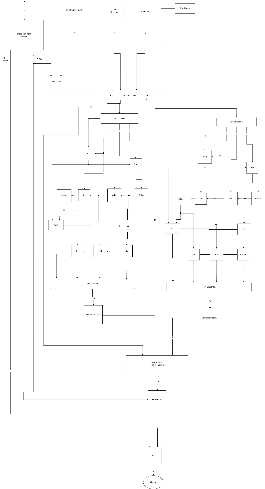

# Small Scale Implementation of ChaCha20 Encrypter

<!-- First Section -->

## Team Details

<details>
  <summary>Detail</summary>

> Semester: 3rd Sem B. Tech. CSE

> Section: S1

> Team ID: 19

> Member-1: Akhil Sakthieswaran, 231CS108, akhilsakthieswaran.231cs108@nitk.edu.in

> Member-2: Raunil Singh, 231CS148, raunilsingh.231cs148@nitk.edu.in

> Member-3: Sanjay S Bhat, 231CS153, sanjay.231cs153@nitk.edu.in

</details>

<!-- Second Section -->

## Abstract

<details>
  <summary>Detail</summary>
  
  > 
Implementing ChaCha20 on a small-scale hardware system offers an efficient and secure solution for resource-constrained devices like IoT and embedded systems. Its lightweight design ensures low power consumption and high performance without specialized hardware, whileproviding robust encryption, making it ideal for real-time data protection in energy-sensitive applications.<p>

The problem statement we are dealing with in our project is developing a hardware circuit implementation of the ChaCha20 encryption algorithm to enhance throughput, reduce latency, and minimize power consumption. Our design is planned to enable efficient processing for secure communications in embedded systems, addressing limitations found in software implementations while ensuring adaptability for various applications and maintaining high security standards.<p>

The main features of our project include removing the very drawbacks in the implementation of the chacha20 algorithm without using circuits. High latency in software can hinder real-time applications,which can be dealt with using circuits,as hardware circuits can reduce processing time through dedicated data paths and pipelining. Software often consumes more power due to CPU overhead.On the other hand,circuits can be designed for low power operation, ideal for battery-operated devices.Another major pro of using hardware circuits to implement the chacha20 algorithm is that hardware circuits can mitigate certain side-channel attacks through physical design features, enhancing overall security.Finally, software may require significant RAM and CPU resources. Circuits can use smaller, dedicated memory and logic components for efficiency,leading to significant optimization of the implementation

</details>

## Functional Block Diagram

<details>
  <summary>Detail</summary>

> 

</details>

<!-- Third Section -->

## Working

<details>
  <summary>Detail</summary>

> Explain how your model works with the help of a functional table (compulsory) followed by the flowchart.

</details>

<!-- Fourth Section -->

## Logisim Circuit Diagram

<details>
  <summary>Detail</summary>

>

### Instructions:

```
Step 1:
Set initial counter value, 8-bit key and nonce.

Step 2:
Set lock to 1 to lock the initial counter value and then set it back to 0.

Step 3:
To give inputs, use the switches for 0 and 1 respectivetly. For example, to give input 1, set '1 switch' to 1, read the output bit and then set it back to 0. Continue the same process for all the input bits.

Step 4:
To reset the circuit the lock can simply be turned to 1 and then set to 0.
```

### Overall Circuit:


### Key Stream Generator:


### Bit Selector:


### Decoder:


### Quarter Round Generator:


### 2-bit Counter:


### Plain Text Input:


</details>

<!-- Fifth Section -->

## Verilog Code

<details>
  <summary>Detail</summary>

> Neatly update the Verilog code in code style only.

</details>

## References

<details>
  <summary>Detail</summary>
  
>
1. ComputerPhile - YouTube<br>
https://youtu.be/UeIpq-C-GSA?si=nAy34VoO6TG0Eg_5<p>
2. ChaCha20 and Poly1305 for IETF Protocols<br> https://datatracker.ietf.org/doc/html/rfc7539<p>
3. Wikipedia<br>
https://en.wikipedia.org/wiki/ChaCha20-Poly1305
   
</details>
